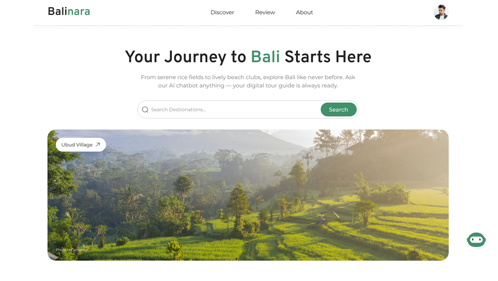

# Balinara 🌴 - Discover Bali's Hidden Gems

Selamat datang di Balinara, sebuah platform digital berbasis web yang dirancang untuk menjadi pemandu utama Anda dalam menjelajahi keindahan Pulau Dewata. Dari pura yang megah di atas tebing hingga air terjun tersembunyi, Balinara membantu para pelancong menemukan destinasi ikonik dan permata tersembunyi di Bali dengan lebih percaya diri.

Proyek ini dibangun sebagai **Aplikasi Web Full-Stack** dengan arsitektur terpisah (_decoupled_), menggabungkan kekuatan _backend_ yang robust dengan _frontend_ yang modern dan interaktif.



---

## ✨ Fitur Utama

Balinara tidak hanya sekadar direktori, tetapi sebuah ekosistem pariwisata yang lengkap:

- **🔍 Pencarian & Filter Canggih**: Temukan destinasi dengan mudah berdasarkan nama, kategori (Pantai, Pura, Gunung), lokasi (kabupaten), dan rating.
- **✍️ Sistem Ulasan & Rating**: Pengguna dapat memberikan ulasan, rating bintang, dan mengunggah foto pengalaman mereka untuk membantu sesama pelancong.
- **❤️ Wishlist Pribadi**: Simpan destinasi impian Anda dalam satu daftar keinginan yang mudah diakses.
- **🗺️ Peta Interaktif**: Jelajahi Bali melalui peta interaktif yang menunjukkan lokasi setiap kabupaten beserta deskripsinya.
- **👨‍💻 Panel Admin Fungsional**: Antarmuka khusus untuk admin mengelola (CRUD) semua data destinasi, kategori, fasilitas, serta memoderasi ulasan dan usulan dari pengguna.
- **💡 Usulkan Tempat Baru**: Fitur bagi komunitas untuk menyarankan destinasi baru yang belum terdaftar, lengkap dengan alur kerja moderasi oleh admin.
- **🔐 Otentikasi Ganda**: Pengguna dapat mendaftar dan login menggunakan email & password tradisional, atau secara instan melalui akun Google (OAuth 2.0).
- **↔️ Carousel Interaktif**: Daftar destinasi unggulan dapat digeser (_drag & scroll_) untuk pengalaman pengguna yang lebih dinamis, ditenagai oleh GSAP Draggable.
- **🖼️ Galeri Gambar Lightbox**: Lihat detail gambar ulasan dalam modal _lightbox_ yang imersif menggunakan vue-easy-lightbox.

---

## 🛠️ Teknologi yang Digunakan

Arsitektur aplikasi ini terpisah (_decoupled_) untuk memastikan skalabilitas dan kemudahan pemeliharaan.

- **Backend**:

  - **Framework**: Django & Django REST Framework
  - **Database**: MySQL
  - **Otentikasi**: Token-based (untuk email).
  - **Penyimpanan File**: Sistem file lokal dengan logika untuk memproses dan menyimpan gambar ke lokasi permanen.
  - **Fitur Lain**: Django Signals, Django Filters untuk API yang dinamis.

- **Frontend**:
  - **Framework**: Vue.js (dengan Composition API & `<script setup>`)
  - **State Management**: Pinia
  - **Routing**: Vue Router
  - **HTTP Client**: Axios
  - **Styling**: Tailwind CSS
  - **Animasi**: GSAP (GreenSock Animation Platform)
  - **UI Library**: Vue Easy Lightbox

---

## 🚀 Cara Menjalankan Proyek

### Prasyarat

Pastikan Anda sudah menginstal:

- Python 3.x
- Node.js & npm
- MySQL Server

### Backend (Django)

1.  Masuk ke direktori `backend`.
2.  Buat dan aktifkan _virtual environment_:
    ```bash
    python -m venv env
    source env/bin/activate  # atau `env\Scripts\activate` di Windows
    ```
3.  Instal semua dependensi:
    ```bash
    pip install -r requirements.txt
    ```
4.  Jalankan migrasi database:
    ```bash
    python manage.py migrate
    ```
5.  Jalankan server backend:
    ```bash
    python manage.py runserver
    ```
    API akan berjalan di `http://127.0.0.1:8000`.

### Frontend (Vue)

1.  Buka terminal baru dan masuk ke direktori `frontend`.
2.  Instal semua dependensi:
    ```bash
    npm install
    ```
3.  Jalankan development server:
    ```bash
    npm run dev
    ```
    Aplikasi frontend akan berjalan di `http://localhost:5173`.

---

## ⚙️ Konfigurasi Environment

Proyek ini memerlukan beberapa kunci API dan variabel environment agar bisa berjalan.

1.  **Salin File Contoh**: Di dalam direktori `backend`, salin file `.env.example` menjadi sebuah file baru bernama `.env`.

    ```bash
    cp .env.example .env
    ```

2.  **Isi Nilai**: Buka file `.env` yang baru Anda buat dan isi semua nilai variabel sesuai dengan kunci API dan konfigurasi lokal Anda.
    - `CLOUDINARY_*` & `GEMINI_*`: Isi jika Anda menggunakannya.

File `.env` ini bersifat rahasia dan sudah dimasukkan ke dalam `.gitignore`, sehingga tidak akan terunggah ke repositori.

---

Terima kasih telah menjelajahi Balinara! Proyek ini adalah demonstrasi dari implementasi fitur-fitur web modern dalam sebuah studi kasus yang nyata dan menarik.
